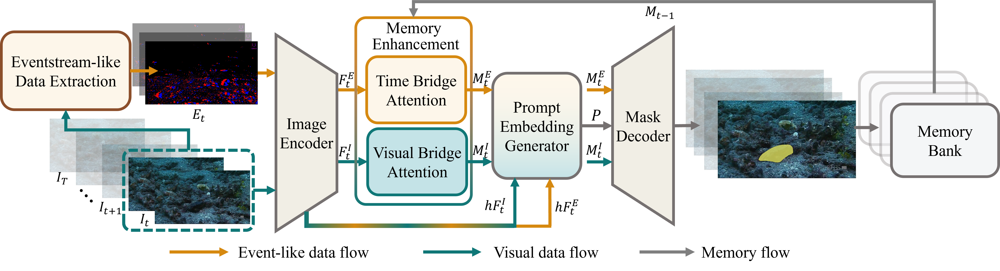

# EventVCOD: Towards Explainable Video Camouflaged Object Detection

[](./assets/Towards_Explainable_Video_Camouflaged_Object_Detection__SAM2_with_Eventstream_Inspired_Data_AAAI_26.pdf)
[](./assets/Towards_Explainable_Video_Camouflaged_Object_Detection__SAM2_with_Eventstream_Inspired_Data_Supp_AAAI_26.pdf)
[](LICENSE)

Official implementation of **"Towards Explainable Video Camouflaged Object Detection: SAM2 with Eventstream-Inspired Data"** (AAAI 2026).

## 📋 Overview

EventVCOD introduces a novel framework for Video Camouflaged Object Detection (VCOD) by leveraging **event camera-inspired data** and **Segment Anything Model 2 (SAM2)**. Our approach provides explainable detection through event-based motion representations that capture temporal dynamics invisible to standard RGB cameras.

<p align="center">
  
</p>

### Key Features

- 🎯 **SAM2-based Architecture**: Fine-tuned SAM2 with custom prompt generators for VCOD
- ⚡ **Event-Inspired Data**: Novel eventstream-like representation from RGB videos
- 🎬 **Video Understanding**: Temporal coherence through event polarity (+/-) encoding
- 🔍 **Explainable Detection**: Motion-based interpretable features
- 📊 **State-of-the-art Performance**: Superior results on MoCA-Mask-Video and CAD-2016 benchmarks

## 🏗️ Architecture

Our framework consists of three main components:

1. **Event-Inspired Data Generation**: Convert RGB frames to event-like representations with positive/negative polarities
2. **Prompt Generator**: Dense embedding generator for SAM2 conditioning
3. **SAM2 Backbone**: Fine-tuned image encoder with memory attention mechanism

## 📦 Installation

### Prerequisites

- Python 3.8+
- CUDA 12.1+
- PyTorch 2.3.0+

### Setup

```bash
# Clone the repository
git clone https://github.com/yourusername/EventVCOD.git
cd EventVCOD

# Install dependencies
pip install -r requirements.txt

# Install SAM2
pip install -e .
```

### Dependencies

Main dependencies include:
- `torch>=2.3.0`
- `torchvision>=0.18.0`
- `opencv-python>=4.8.0`
- `numpy>=1.24.2`
- `Pillow>=9.4.0`
- `tensorboardX>=2.6.2`
- `timm==0.4.12`

See `requirements.txt` for complete list.

## 📊 Dataset Preparation

### Download Datasets

All datasets and pre-processed event-like data are available at:
- 🔗 [Netdisk](https://bhpan.buaa.edu.cn/link/AAF3D4FA7AB0C34A8DA44EFEA78DC9BC3A)

### Dataset Structure

Organize your datasets as follows:

```
datasets/
├── MoCA-Video-Train_event/
│   ├── crab/
│   ├── flatfish_0/
│   └── ...
├── MoCA-Video-Test_event/
│   ├── arctic_fox/
│   ├── black_cat_1/
│   └── ...
└── CAD2016_event/
    └── ...
```

### Generate Event-Inspired Data

To generate event-like representations from your own RGB videos:

```bash
cd data_manipulate
python eventflow_like_gen_claude.py --input_dir /path/to/videos --output_dir /path/to/output
```

## 🎯 Pre-trained Models

All pre-trained models (including SAM2 checkpoints and fine-tuned EventVCOD models) are available at:
- 🔗 [Netdisk](https://bhpan.buaa.edu.cn/link/AAF3D4FA7AB0C34A8DA44EFEA78DC9BC3A)

Download the checkpoints and place them in the `checkpoints/` directory.

## 🚀 Training

### Single GPU Training

```bash
python train.py --config sam2/configs/sam2.1_training/sam2.1_hiera_b+_VCOD_finetune_tiny_adp0317_video_part2_SAM2_finetune30.yaml
```

### Multi-GPU Distributed Training

```bash
# 4 GPUs example
python -m torch.distributed.launch \
    --nproc_per_node=4 \
    --master_port=29500 \
    train.py \
    --config sam2/configs/sam2.1_training/sam2.1_hiera_b+_VCOD_finetune_tiny_adp0317_video_part2_SAM2_finetune30.yaml \
    --name eventvcod_exp \
    --tag experiment_v1
```

### Training Configuration

Main training parameters in config files:
- `resolution`: Input resolution (default: 1024)
- `train_batch_size`: Batch size per GPU
- `num_frames`: Number of frames per video clip
- `num_epochs`: Total training epochs
- `base_lr`: Base learning rate

Modify configurations in `sam2/configs/sam2.1_training/` for different settings.

## 🧪 Testing & Evaluation

### Run Inference

```bash
python test.py \
    --config sam2/configs/sam2.1/sam2.1_hiera_b+_VCOD_infer_modify.yaml \
    --model /path/to/checkpoint.pth
```

### Evaluation Metrics

We evaluate using standard VCOD metrics:
- **S-measure (Sα)**: Structure similarity
- **E-measure (Eφ)**: Enhanced alignment measure  
- **weighted F-measure (Fwβ)**: Weighted precision-recall
- **MAE (M)**: Mean Absolute Error
- **mean Dice (mDice)**: Dice coefficient
- **mean IoU (mIoU)**: Intersection over Union

### MATLAB Evaluation

For comprehensive evaluation using MATLAB:

```matlab
# For MoCA-Mask-Video dataset
cd eval
run main_MoCA.m

# For CAD-2016 dataset
run main_CAD.m
```

### Python Evaluation

```bash
cd eval/PySODMetrics
python evaluate.py --pred_dir /path/to/predictions --gt_dir /path/to/ground_truth
```

## 📈 Results

### MoCA-Mask-Video Test Set

| Method | Sα↑ | Fwβ↑ | Eφ↑ | M↓ | mDice↑ | mIoU↑ |
|--------|------|------|------|-----|--------|-------|
| RCRNet | .597 | .174 | .583 | .025 | .194 | .137 |
| PNS-Net | .576 | .134 | .536 | .038 | .189 | .133 |
| MG | .547 | .165 | .537 | .095 | .197 | .137 |
| SLT-Net | .656 | .357 | .785 | .021 | .387 | .310 |
| IMEX | .661 | .371 | .778 | .020 | .409 | .319 |
| TSP-SAM(M+P) | .673 | .400 | .766 | .012 | .421 | .345 |
| TSP-SAM(M+B) | .689 | .444 | .808 | .008 | .458 | .388 |
| ZoomNeXt(T=1) | .690 | .395 | .702 | .017 | .420 | .353 |
| ZoomNeXt(T=5) | .734 | .476 | .736 | .010 | .497 | .422 |
| EMIP | .669 | .374 | ↑ | .017 | .424 | .326 |
| EMIP-L | .675 | .381 | ↑ | .015 | .426 | .333 |
| **EventVCOD (Ours)** | **.753** | **.573** | **.855** | **.009** | **.574** | **.496** |

### CAD-2016 Dataset

| Method | Sα↑ | Fwβ↑ | Eφ↑ | M↓ | mDice↑ | mIoU↑ |
|--------|------|------|------|-----|--------|-------|
| RCRNet | ↑ | ↑ | ↑ | ↓ | ↑ | ↑ |
| PNS-Net | .678 | .369 | .720 | .043 | .409 | .309 |
| MG | .613 | .370 | .537 | .070 | .351 | .260 |
| SLT-Net | .669 | .481 | .845 | .030 | .368 | .268 |
| IMEX | .684 | .452 | .813 | .033 | .469 | .370 |
| TSP-SAM(M+P) | .705 | .565 | .836 | .027 | .591 | .422 |
| TSP-SAM(M+B) | .751 | .628 | .865 | .021 | .603 | .496 |
| ZoomNeXt(T=1) | .721 | .525 | .759 | .024 | .523 | .436 |
| ZoomNeXt(T=5) | .757 | .593 | .865 | .020 | .509 | .510 |
| EMIP | .710 | .504 | ↑ | .029 | .528 | .415 |
| EMIP-L | .719 | .514 | ↑ | .028 | .536 | .425 |
| **EventVCOD (Ours)** | **.802** | **.717** | **.887** | **.023** | **.717** | **.615** |

*Note: ↑/↓ indicates metrics not reported in original papers. Full quantitative results available in the paper.*

## 🛠️ Code Structure

```
EventVCOD/
├── sam2/                           # SAM2 core implementation
│   ├── modeling/                   # Model architectures
│   ├── configs/                    # Configuration files
│   │   ├── sam2.1_training/       # Training configs
│   │   └── ablation/              # Ablation study configs
│   └── utils/                      # Utility functions
├── training/                       # Training pipeline
│   ├── trainer.py                 # Main trainer
│   ├── trainer_supervision.py     # Supervised training
│   └── model/                     # Model definitions
├── datasets/                       # Dataset implementations
│   ├── datasets.py                # Dataset loaders
│   └── transform_custom.py        # Data augmentation
├── data_manipulate/               # Event data generation
│   ├── eventflow_like_gen_claude.py  # Event generation
│   └── eventflow_p_n_visualization.ipynb  # Visualization
├── eval/                          # Evaluation scripts
│   ├── PySODMetrics/             # Python metrics
│   └── *.m                       # MATLAB evaluation
├── train.py                       # Training entry point
├── test.py                        # Testing entry point
└── utils.py                       # General utilities
```

## 🔬 Event-Inspired Data Generation

Our event data generation process:

1. **Frame Difference**: Compute temporal derivatives between consecutive frames
2. **Polarity Assignment**: Threshold-based positive/negative event classification
3. **Accumulation**: Aggregate events over time windows
4. **Normalization**: Scale to appropriate intensity ranges

Example usage:

```python
from data_manipulate.eventflow_like_gen_claude import generate_events

events_pos, events_neg = generate_events(
    video_path='path/to/video.mp4',
    threshold=0.2,
    output_dir='path/to/output'
)
```

See `data_manipulate/eventflow_p_n_visualization.ipynb` for visualization examples.


## 📄 License

This project is licensed under the Apache License 2.0 - see the LICENSE file for details.

## 🙏 Acknowledgments

This work builds upon:
- [SAM2](https://github.com/facebookresearch/segment-anything-2) - Meta's Segment Anything Model 2


## 🔗 Resources

- 📄 [Paper PDF](./assets/Towards_Explainable_Video_Camouflaged_Object_Detection__SAM2_with_Eventstream_Inspired_Data_AAAI_26.pdf)
- 📑 [Supplementary Material](./assets/Towards_Explainable_Video_Camouflaged_Object_Detection__SAM2_with_Eventstream_Inspired_Data_Supp_AAAI_26.pdf)
- 💾 [Datasets & Checkpoints (Netdisk)](https://bhpan.buaa.edu.cn/link/AAF3D4FA7AB0C34A8DA44EFEA78DC9BC3A)


---

**Star ⭐ this repository if you find it helpful!**
